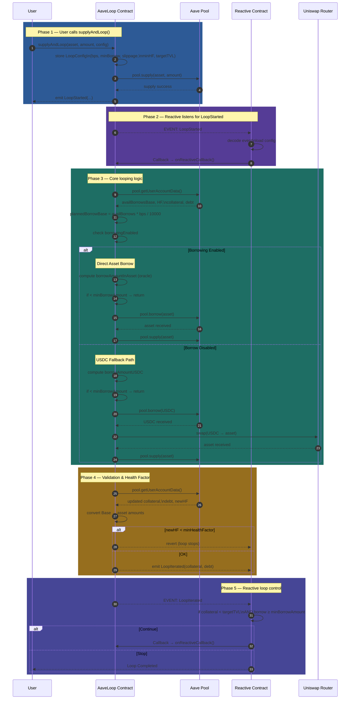

# 📘 Reactive Leveraged Looping Strategy on Aave V3

**Automated multi-step DeFi leveraging powered by Reactive Smart Contracts**

---

## 🔥 Overview

This project implements an **automated leveraged looping strategy** on **Aave V3**, orchestrated using the **Reactive Network**.

A **leveraged loop** is a strategy where a user:

* Supplies collateral
* Borrows against the collateral
* Converts borrowed tokens into more collateral
* Supplies again
* Repeats until a target leverage is reached

⚠️ Normally, users must manually execute **multiple transactions** and continuously monitor risk.

✅ In this project, the user performs **only ONE action**, and the entire loop executes **autonomously** via **event-driven Reactive Smart Contracts**.

---

## 🎯 Goal of the Project

The goal is to convert a **multi-transaction leverage strategy** into a **single-step automated workflow**.

### What we achieve:

* ✅ Automated borrowing
* ✅ Automated swapping
* ✅ Automated re-supplying
* ✅ Automated health factor (HF) protection
* ✅ Automated stop condition based on **target TVL / leverage**

All orchestration is driven by **events + Reactive callbacks**, demonstrating the core value proposition of the **Reactive Network**.

---

## 🏗 High-Level Architecture

### 🧱 AaveLoop.sol

Handles **all financial operations**:

* Supply collateral
* Borrow assets
* Swap assets (if borrowing is disabled)
* Re-supply borrowed assets
* Health Factor calculation
* Target leverage / TVL tracking

---

### 🤖 ReactiveContract.sol

Handles **automation & orchestration**:

* Listens to on-chain events:

  * `LoopStarted`
  * `LoopIterated`
* Triggers `onReactiveCallback()` automatically
* Repeats looping until stop conditions are met

📌 Together, these contracts form a **self-driving leverage engine**.

---

## 🧩 How the System Works (Step-by-Step)

---

### 1️⃣ User starts the looping process

The user calls:

```solidity
supplyAndLoop(asset, amount, config)
```

#### `config` includes:

* Borrow BPS
* Minimum borrow amount
* Maximum slippage
* Minimum health factor
* Target TVL

#### Immediate contract actions:

* Stores user configuration
* Supplies the asset to Aave
* Emits `LoopStarted`

---

### 2️⃣ Reactive Network detects the event

* Reactive contract subscribes to:

  * `LoopStarted`
* Once detected, it automatically triggers:

  * `onReactiveCallback()`

🚀 This initiates the automated loop.

---

### 3️⃣ `onReactiveCallback()` executes one loop iteration

#### ✔️ A. Fetch account data

* Available borrows
* Current collateral
* Current debt
* Current health factor

---

#### ✔️ B. Borrow path selection

* **If asset is borrow-enabled**

  * Borrow the same asset directly
* **Else**

  * Borrow USDC (fallback path)

---

#### ✔️ C. Slippage protection (fallback path only)

```text
minOut = expectedOut × (10000 − maxSlippageBps) / 10000
```

Ensures swaps cannot degrade the health factor.

---

#### ✔️ D. Re-supply borrowed assets

* All borrowed / swapped assets are supplied back into Aave

---

#### ✔️ E. Recalculate system state

* Collateral (asset terms)
* Debt (asset terms)
* New health factor

---

#### ✔️ F. Enforce user safety constraints

* If `HF < minHealthFactor` → loop stops

---

#### ✔️ G. Emit iteration event

* Emits `LoopIterated`
* Reactive Network consumes this event

---

### 4️⃣ Reactive Network decides whether to continue

The Reactive contract evaluates:

* Current collateral
* Current debt
* Target TVL
* Minimum borrow amount
* Borrow BPS

#### Decision logic:

```text
if collateral < targetTVL
AND nextBorrowAmount ≥ minBorrowAmount:
    continue looping
else:
    stop looping
```

---

### ✅ Guarantees:

* Target leverage is not exceeded
* Loops stop when borrow size becomes inefficient
* Risk is controlled via health factor constraints

---

## 🧠 What We Are Checking & Why

| Check                   | Purpose                               |
| ----------------------- | ------------------------------------- |
| Borrow Enabled?         | Choose direct borrow vs USDC fallback |
| Minimum Borrow Amount   | Avoid gas-inefficient micro-loops     |
| Maximum Slippage        | Prevent value loss during swaps       |
| Health Factor ≥ Minimum | Prevent liquidation risk              |
| Target TVL Reached      | Stop at desired leverage              |
| `availableBorrowsBase`  | Calculate safe borrow limits          |

These checks ensure **safety, predictability, and capital efficiency**.

---

## 🏆 What We Are Achieving

By integrating the **Reactive Network**:

* ✅ Multi-step leverage becomes **one user transaction**
* ✅ Users no longer need to:

  * Manually borrow
  * Manually swap
  * Manually re-supply
  * Manually monitor HF
  * Manually stop looping
* ✅ Looping runs **autonomously**
* ✅ User-defined parameters fully control risk
* ✅ Entire flow is **on-chain & trustless**

🎯 This directly satisfies the bounty requirements.

---

## 🔄 User Flow Diagram




## 🧵 How Reactive Is Being Leveraged

Reactive Network acts as the **brain of the system**:

* Listens to on-chain events
* Automatically triggers callbacks
* Coordinates multi-step DeFi actions
* Repeats execution without user involvement
* Stops execution when conditions are met

❌ Without Reactive:

* User must manually borrow, swap, supply, monitor HF, and stop

✅ With Reactive:

* The entire loop becomes a **self-executing on-chain workflow**

---

## 🛑 Edge Case Handling

* **Slippage Protection**
  Prevents swaps from harming HF

* **Health Factor Enforcement**
  Stops before liquidation risk

* **Minimum Borrow Threshold**
  Avoids inefficient looping

* **Borrow Enabled Check**
  Ensures fallback path always exists

---

## 📌 Conclusion

This project delivers a **fully autonomous, safe, and user-parameterized leveraged looping strategy** on Aave V3 using **Reactive Smart Contracts**.

It demonstrates how **Reactive Network** can automate complex, multi-step DeFi strategies through **event-driven orchestration**, which is exactly the objective of the bounty.

---


# 🚀 Deployment & Execution Walkthrough (Base Mainnet)

This section walks through **how the system is deployed**, **why Base mainnet is used**, and **what to expect during execution** when running the provided scripts.

---

## 🌐 Why Base Mainnet?

For this demo, **Base mainnet** is used for deployment and execution.

This is intentional because:

* **Aave V3** is fully available and stable on Base mainnet
* **Reactive Network callbacks** are compatible with Base mainnet
* Aave testnets and Reactive testnets do **not fully align**, which can cause mismatched behavior

📌 Using Base mainnet ensures the looping logic behaves exactly as it would in production.

---
## ⚙️ Required Environment Variables

Before running any scripts, make sure the following environment variables are set:

```bash
export BASE_RPC=https://mainnet.base.org
export PRIVATE_KEY=

export REACTIVE_RPC=https://mainnet-rpc.rnk.dev/
export SYSTEM_CONTRACT_ADDR=0x0000000000000000000000000000000000fffFfF

export WETH_ADDRESS=0x4200000000000000000000000000000000000006
export ADDRESS_PROVIDER=0xe20fCBdBfFC4Dd138cE8b2E6FBb6CB49777ad64D
export USDC=0x833589fCD6eDb6E08f4c7C32D4f71b54bdA02913
export UNISWAP_ROUTER=0x4752ba5dbc23f44d87826276bf6fd6b1c372ad24

export REACTIVE_CALLBACK=0x0D3E76De6bC44309083cAAFdB49A088B8a250947
export BASE_CHAINID=8453

export AAVE_LOOP=
export REACTIVE_CONTRACT=
```


## 🧪 Example Configuration Used in This Demo

For demonstration and testing, we use the following setup:

* **Asset**: WETH
* **Initial supply**: `0.003 WETH`
* **Borrow per iteration**: `70%` of available borrow capacity
* **Minimum borrow amount**: `0.00003 WETH`
* **Minimum health factor**: `1.0`
* **Target TVL**: `0.01 WETH`

This configuration is intentionally small so the full loop can be observed clearly on-chain.

---

## 🔁 What Happens During Execution (Iteration by Iteration)

After the initial supply, the loop runs **automatically** via Reactive callbacks.

Because Aave enforces **LTV and health factor constraints**, each iteration borrows **less than the previous one**, resulting in gradual growth.

Below is an **approximate** progression you should expect:

| Iteration | Approx Collateral (TVL) |
| --------- | ----------------------- |
| Initial   | 0.0030 WETH             |
| 1         | ~0.0047 WETH            |
| 2         | ~0.0061 WETH            |
| 3         | ~0.0074 WETH            |
| 4         | ~0.0084 WETH            |
| 5         | ~0.0093 WETH            |
| 6         | ~0.0101 WETH ✅          |

📌 **Expected total iterations: ~5–6**

The loop stops automatically once the collateral crosses the **0.01 WETH target TVL**.

---

## 🧾 Deployment & Execution Scripts

Below are the exact scripts used, along with a brief explanation of what each one does.

---

### 1️⃣ Deploy AaveLoop (Base Mainnet)

```bash
forge create --broadcast --rpc-url $BASE_RPC --private-key $PRIVATE_KEY \
src/AaveLoop.sol:AaveLoop \
--constructor-args $ADDRESS_PROVIDER $USDC $UNISWAP_ROUTER $REACTIVE_CALLBACK --legacy
```

Deploys the contract that holds funds and executes Aave supply, borrow, swap, and re-supply logic.

---

### 2️⃣ Fund AaveLoop for Reactive Callbacks

```bash
cast send $AAVE_LOOP --value 0.001ether --rpc-url $BASE_RPC --private-key $PRIVATE_KEY --legacy
```

Adds ETH used only to pay Reactive callback execution fees.

---

### 3️⃣ Deploy Reactive Contract (Reactive Network)

```bash
forge create --broadcast --rpc-url $REACTIVE_RPC --private-key $PRIVATE_KEY \
src/Reactive.sol:ReactiveContract \
--constructor-args $SYSTEM_CONTRACT_ADDR $BASE_CHAINID $AAVE_LOOP --legacy
```

Deploys the Reactive automation contract that listens to AaveLoop events.

---

### 4️⃣ Fund Reactive Contract

```bash
cast send $REACTIVE_CONTRACT --value 10ether --rpc-url $REACTIVE_RPC --private-key $PRIVATE_KEY --legacy
```

Funds cross-chain execution for multiple automated iterations.

---

### 5️⃣ Approve WETH for AaveLoop

```bash
cast send $WETH_ADDRESS "approve(address,uint256)" $AAVE_LOOP 0.003ether \
--rpc-url $BASE_RPC --private-key $PRIVATE_KEY --legacy
```

Allows AaveLoop to transfer the initial WETH collateral.

---

### 6️⃣ Start the Loop (Single User Action)

```bash
cast send $AAVE_LOOP \
"supplyAndLoop(address,uint256,uint16,uint256,uint16,uint256,uint256)" \
$WETH_ADDRESS 0.003ether 7000 0.00003ether 5000 10000 0.01ether \
--rpc-url $BASE_RPC --private-key $PRIVATE_KEY --legacy
```

Supplies WETH and triggers the fully autonomous looping process.

---

## ✅ Final Notes

* The user submits **one transaction**
* All subsequent iterations are **event-driven**
* No keepers, no bots, no manual intervention
* Iterations stop naturally once the target TVL is reached

---

### 🧠 In Simple Terms

> You provide a small amount of WETH,
> the system automatically builds leverage in safe steps,
> and stops exactly where you tell it to.


