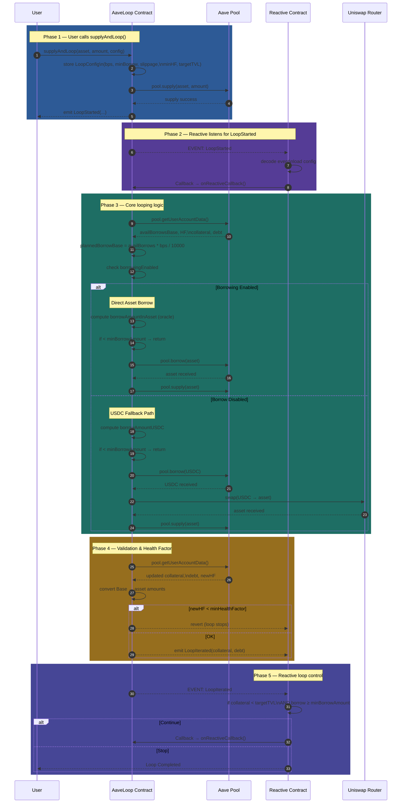

# 📘 Reactive Leveraged Looping Strategy on Aave V3

**Automated multi-step DeFi leveraging powered by Reactive Smart Contracts**

---

## 🔥 Overview

This project implements an **automated leveraged looping strategy** on **Aave V3**, orchestrated using the **Reactive Network**.

A **leveraged loop** is a strategy where a user:

* Supplies collateral
* Borrows against the collateral
* Converts borrowed tokens into more collateral
* Supplies again
* Repeats until a target leverage is reached

⚠️ Normally, users must manually execute **multiple transactions** and continuously monitor risk.

✅ In this project, the user performs **only ONE action**, and the entire loop executes **autonomously** via **event-driven Reactive Smart Contracts**.

---

## 🎯 Goal of the Project

The goal is to convert a **multi-transaction leverage strategy** into a **single-step automated workflow**.

### What we achieve:

* ✅ Automated borrowing
* ✅ Automated swapping
* ✅ Automated re-supplying
* ✅ Automated health factor (HF) protection
* ✅ Automated stop condition based on **target TVL / leverage**

All orchestration is driven by **events + Reactive callbacks**, demonstrating the core value proposition of the **Reactive Network**.

---

## 🏗 High-Level Architecture

### 🧱 AaveLoop.sol

Handles **all financial operations**:

* Supply collateral
* Borrow assets
* Swap assets (if borrowing is disabled)
* Re-supply borrowed assets
* Health Factor calculation
* Target leverage / TVL tracking

---

### 🤖 ReactiveContract.sol

Handles **automation & orchestration**:

* Listens to on-chain events:

  * `LoopStarted`
  * `LoopIterated`
* Triggers `onReactiveCallback()` automatically
* Repeats looping until stop conditions are met

📌 Together, these contracts form a **self-driving leverage engine**.

---

## 🧩 How the System Works (Step-by-Step)

---

### 1️⃣ User starts the looping process

The user calls:

```solidity
supplyAndLoop(asset, amount, config)
```

#### `config` includes:

* Borrow BPS
* Minimum borrow amount
* Maximum slippage
* Minimum health factor
* Target TVL

#### Immediate contract actions:

* Stores user configuration
* Supplies the asset to Aave
* Emits `LoopStarted`

---

### 2️⃣ Reactive Network detects the event

* Reactive contract subscribes to:

  * `LoopStarted`
* Once detected, it automatically triggers:

  * `onReactiveCallback()`

🚀 This initiates the automated loop.

---

### 3️⃣ `onReactiveCallback()` executes one loop iteration

#### ✔️ A. Fetch account data

* Available borrows
* Current collateral
* Current debt
* Current health factor

---

#### ✔️ B. Borrow path selection

* **If asset is borrow-enabled**

  * Borrow the same asset directly
* **Else**

  * Borrow USDC (fallback path)

---

#### ✔️ C. Slippage protection (fallback path only)

```text
minOut = expectedOut × (10000 − maxSlippageBps) / 10000
```

Ensures swaps cannot degrade the health factor.

---

#### ✔️ D. Re-supply borrowed assets

* All borrowed / swapped assets are supplied back into Aave

---

#### ✔️ E. Recalculate system state

* Collateral (asset terms)
* Debt (asset terms)
* New health factor

---

#### ✔️ F. Enforce user safety constraints

* If `HF < minHealthFactor` → loop stops

---

#### ✔️ G. Emit iteration event

* Emits `LoopIterated`
* Reactive Network consumes this event

---

### 4️⃣ Reactive Network decides whether to continue

The Reactive contract evaluates:

* Current collateral
* Current debt
* Target TVL
* Minimum borrow amount
* Borrow BPS

#### Decision logic:

```text
if collateral < targetTVL
AND nextBorrowAmount ≥ minBorrowAmount:
    continue looping
else:
    stop looping
```

---

### ✅ Guarantees:

* Target leverage is not exceeded
* Loops stop when borrow size becomes inefficient
* Risk is controlled via health factor constraints

---

## 🧠 What We Are Checking & Why

| Check                   | Purpose                               |
| ----------------------- | ------------------------------------- |
| Borrow Enabled?         | Choose direct borrow vs USDC fallback |
| Minimum Borrow Amount   | Avoid gas-inefficient micro-loops     |
| Maximum Slippage        | Prevent value loss during swaps       |
| Health Factor ≥ Minimum | Prevent liquidation risk              |
| Target TVL Reached      | Stop at desired leverage              |
| `availableBorrowsBase`  | Calculate safe borrow limits          |

These checks ensure **safety, predictability, and capital efficiency**.

---

## 🏆 What We Are Achieving

By integrating the **Reactive Network**:

* ✅ Multi-step leverage becomes **one user transaction**
* ✅ Users no longer need to:

  * Manually borrow
  * Manually swap
  * Manually re-supply
  * Manually monitor HF
  * Manually stop looping
* ✅ Looping runs **autonomously**
* ✅ User-defined parameters fully control risk
* ✅ Entire flow is **on-chain & trustless**

🎯 This directly satisfies the bounty requirements.

---

## 🔄 User Flow Diagram




## 🧵 How Reactive Is Being Leveraged

Reactive Network acts as the **brain of the system**:

* Listens to on-chain events
* Automatically triggers callbacks
* Coordinates multi-step DeFi actions
* Repeats execution without user involvement
* Stops execution when conditions are met

❌ Without Reactive:

* User must manually borrow, swap, supply, monitor HF, and stop

✅ With Reactive:

* The entire loop becomes a **self-executing on-chain workflow**

---

## 🛑 Edge Case Handling

* **Slippage Protection**
  Prevents swaps from harming HF

* **Health Factor Enforcement**
  Stops before liquidation risk

* **Minimum Borrow Threshold**
  Avoids inefficient looping

* **Borrow Enabled Check**
  Ensures fallback path always exists

---

## 📌 Conclusion

This project delivers a **fully autonomous, safe, and user-parameterized leveraged looping strategy** on Aave V3 using **Reactive Smart Contracts**.

It demonstrates how **Reactive Network** can automate complex, multi-step DeFi strategies through **event-driven orchestration**, which is exactly the objective of the bounty.


